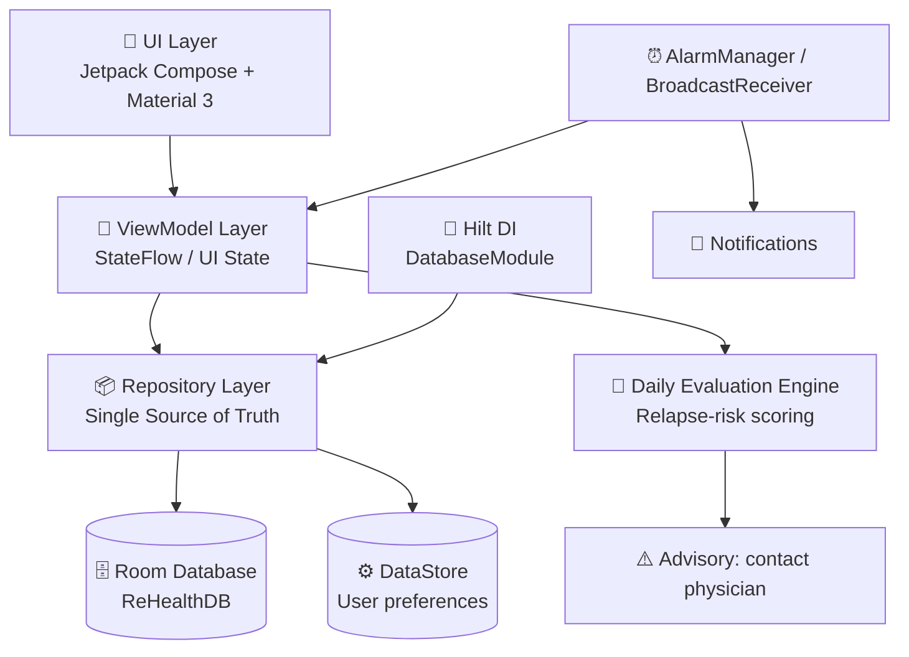

```markdown
# 🧠 RHealth — Bipolar Disorder Companion App

<p align="center">
  
</p>

<p align="center">
  <a href="https://cafebazaar.ir/app/com.example.rehealth?l=en"></a>
  
  
  
  
  
  
</p>

> **RHealth** is an Android companion application designed to support patients with **bipolar disorder** throughout their treatment journey. It reminds patients to take their medication, perform prescribed tests, and attend follow-up visits, and it performs a **daily self-evaluation** that flags early signs of relapse so the patient can seek medical attention promptly.

> 📄 A peer-reviewed scientific paper describing the design, clinical rationale, and evaluation of RHealth is currently **under review**. A citation entry will be added here once it is accepted.

---

## ⚠️ Medical Disclaimer

RHealth is a **self-management and adherence-support tool**. It is **not** a medical device, a diagnostic instrument, or a substitute for professional psychiatric care. The daily evaluation module produces an advisory flag intended to encourage timely contact with a qualified clinician; it does **not** output a clinical diagnosis. Always consult a licensed physician for diagnosis and treatment decisions.

---

## ✨ Features

| Module | Description |
|---|---|
| 💊 **Medication Reminders** | Schedule, edit, and track daily medication intake with alarm-based notifications. Includes drug information and side-effect awareness. |
| 🧪 **Test Reminders** | Reminds patients of upcoming laboratory tests (e.g. lithium serum level, CBC) required by their treatment plan. |
| 📅 **Visit Reminders** | Tracks the next psychiatric follow-up appointment and alerts the patient in advance. |
| 📝 **Daily Self-Evaluation** | A short daily questionnaire (quiz-based) that monitors mood and early relapse indicators. If responses suggest elevated risk, the app advises the patient to contact their physician. |
| ⚠️ **Side-Effect Tracking** | Patients can log observed side effects per medication, helping clinicians adjust prescriptions. |
| 🔒 **Privacy-First** | All patient data is stored **locally** on-device using an encrypted Room database; no data leaves the phone. |
| 🌙 **Material 3 UI** | A calm, accessible Compose UI with animated navigation and Lottie micro-interactions suited for long-term daily use. |

---

## 📸 Screenshots

<p align="center">
  
  
  
  
</p>

---

## 🏗️ Architecture

RHealth follows a **layered MVVM** architecture built on the Android Jetpack stack, with a single source of truth in the local Room database and unidirectional data flow through Kotlin `Flow`/`StateFlow`.



**Why this matters clinically:** all patient data stays on-device, the evaluation logic is deterministic and auditable, and alarm-driven reminders survive device restarts via `BroadcastReceiver`s.

---

## 🛠️ Tech Stack

| Category | Technology |
|---|---|
| **Language** | Kotlin 1.7.20 |
| **UI Toolkit** | Jetpack Compose (BOM 2022.10.00) + Material 3 |
| **Architecture** | MVVM + Repository pattern, Unidirectional Data Flow |
| **Dependency Injection** | Hilt 2.46.1 |
| **Local Database** | Room 2.5.2 (with KSP/kapt compiler, TypeConverters) |
| **Preferences** | Jetpack DataStore Preferences 1.0.0 |
| **Navigation** | Navigation Compose 2.6.0 + Animated Navigation Bar (exyte) |
| **Scheduling** | AlarmManager + BroadcastReceiver (boot-resilient reminders) |
| **Date/Time** | `java.time` via Core Library Desugaring 1.2.2 + sheets-compose-dialogs (calendar & clock pickers) |
| **Animations** | Lottie Compose 6.1.0 |
| **Build** | Android Gradle Plugin 8.1.1, Gradle (Kotlin DSL ready) |
| **Min SDK / Target SDK** | 26 (Android 8.0) / 33 (Android 13) |

---

## 🚀 Getting Started

### Prerequisites

- **Android Studio** Giraffe or newer (Hedgehog recommended)
- **JDK 17**
- Android device or emulator running **API 26+**

### Build & Run

```bash
# 1. Clone the repository
git clone https://github.com/sinaveisi/RHealth.git
cd RHealth

# 2. (Optional) Open in Android Studio and let Gradle sync,
#    or build from the command line:
./gradlew assembleDebug

# 3. Install on a connected device
./gradlew installDebug
```

### Download the released APK

The app is already published on the Iranian Android market:

👉 **[Download RHealth from CafeBazaar](https://cafebazaar.ir/app/com.example.rehealth?l=en)**

---

## 📁 Project Structure

```
app/src/main/java/com/example/rehealth/
├── MainActivity.kt              # Compose host activity
├── MedicineActivity.kt          # Medication management entry
├── reHealthApplication.kt       # Application class (@HiltAndroidApp)
│
├── data/
│   ├── models/                  # Room entities & domain models
│   │   ├── medicines.kt         # Medication entity
│   │   ├── medicineWithSideEffects.kt
│   │   ├── SideEffects.kt
│   │   ├── TestReminder.kt      # Lab test reminder entity
│   │   ├── VisitReminder.kt     # Follow-up visit reminder
│   │   ├── QuizReminder.kt      # Daily evaluation scheduler
│   │   ├── quiz/                # Quiz questions & scoring model
│   │   ├── drug/                # Drug reference data
│   │   ├── association/         # Medicine ↔ side-effect links
│   │   ├── UserIdentification.kt
│   │   └── LockClass.kt
│   ├── prepopulate/             # Seed data (drug catalogue, default quiz)
│   ├── repository/              # Repository abstraction over DAOs
│   ├── interfaces/              # DAO contracts
│   ├── convertor/               # Room TypeConverters
│   ├── broadcast/               # AlarmReceiver & BootReceiver
│   ├── MedicineDao.kt
│   └── ReHealthDB.kt            # RoomDatabase definition
│
├── di/
│   └── DatabaseModule.kt        # Hilt module providing DB & DAOs
│
├── navigation/
│   └── (Compose Navigation graph)
│
├── ui/
│   ├── screens/
│   │   ├── main/                # Home dashboard
│   │   ├── setting/             # User preferences
│   │   └── sideeffects/         # Side-effect logging UI
│   ├── theme/                   # Material 3 color & type schemes
│   └── viewmodel/               # ViewModels exposing UI state
│
└── util/                        # Extensions & helpers
```

---

## 🧪 The Daily Evaluation Module

The distinguishing feature of RHealth is the **daily self-evaluation quiz**, designed to capture early warning signs of a bipolar relapse (both depressive and manic poles). The flow is:

1. **Scheduled trigger** — `QuizReminder` schedules a daily notification at a patient-chosen time.
2. **Questionnaire** — the patient answers a short, clinically-informed set of questions.
3. **Scoring** — responses are scored by the evaluation engine in the ViewModel layer.
4. **Advisory output** — if the score crosses a threshold, the app displays a clear, non-alarmist prompt to contact the treating physician; otherwise it logs the result for longitudinal self-tracking.

> The exact questionnaire items and scoring thresholds are documented in the accompanying paper (under review). Researchers interested in the instrument should contact the author.

---
---

## 📄 Citation

A scientific paper describing RHealth's design and clinical evaluation is currently **under peer review**. Once accepted, please cite it.


> Until the paper is accepted, please cite this repository directly if you reference RHealth in your work.

---

## 🤝 Contributing

Contributions are welcome — especially around accessibility, localization, and clinical UX. To contribute:

1. Fork the repository
2. Create a feature branch: `git checkout -b feature/your-feature`
3. Commit using [Conventional Commits](https://www.conventionalcommits.org) (`feat:`, `fix:`, `docs:`…)
4. Open a Pull Request describing the change and its rationale

Please open an issue first for major changes so the design can be discussed.

---

## 📜 License

Released under the **MIT License** — see the [LICENSE](LICENSE) file for details.
If you add a more restrictive license for clinical-software reasons (e.g. Apache 2.0 with a clinical-use clause), update this section accordingly.

---

## 🙏 Acknowledgments

- Patients and clinicians who informed the requirements during the design phase

---

## 📫 Contact

**Sina Veisi** 

- GitHub: [@sinaveisi](https://github.com/sinaveisi)
- ORCID: [0009-0006-0463-4205](https://orcid.org/0009-0006-0463-4205)
- App on CafeBazaar: [cafebazaar.ir/app/com.example.rehealth](https://cafebazaar.ir/app/com.example.rehealth?l=en)

_Project repository: [github.com/sinaveisi/RHealth](https://github.com/sinaveisi/RHealth)_
```
